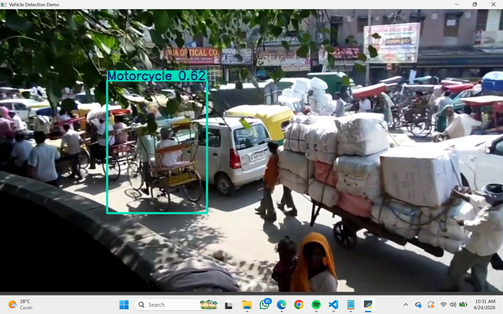

# Vehicle Detection with YOLOv8

This project detects vehicles from images and video using a YOLOv8 model trained on 5 classes:

This project focuses on building an end-to-end object detection pipeline, including data handling, training, evaluation, and inference.

- Ambulance
- Bus
- Car
- Motorcycle
- Truck

## Project Structure

- `dataset.yaml` - YOLO dataset config
- `requirements.txt` - Python dependencies
- `train/images`, `train/labels` - training set
- `valid/images`, `valid/labels` - validation set
- `test/images`, `test/labels` - test set
- `runs/detect/train/weights/best.pt` - trained model weights
- `test_video.py` - run detection on local video (`video_traffic.mp4`)
- `test_live.py` - run detection from live camera stream URL
- `yolov8n.pt` - pre-trained YOLOv8 nano model

The model is fine-tuned from YOLOv8n pretrained weights.

## Detection Preview



## Current Model Performance

The model still has room for improvement.

- mAP50: ~0.60
- mAP50-95: ~0.45

Current performance is limited partly because of hardware/device constraints during training and experimentation.

Model performance can be further improved through hyperparameter tuning, larger architectures, and additional training epochs.

## Requirements

Install Python dependencies:

```bash
pip install -r requirements.txt
```

**Packages:**
- `ultralytics>=8.0.0` - YOLOv8 framework
- `opencv-python>=4.5.0` - Computer vision library

## Run Inference

### 1) Local video demo

```bash
python test_video.py
```

### 2) Live camera stream demo

Update the `url` value in `test_live.py`, then run:

```bash
python test_live.py
```

## Dataset Configuration

Your `dataset.yaml` currently uses:

- `train: ../train/images`
- `val: ../valid/images`
- `test: ../test/images`
- `nc: 5`

## Data Quality Note

The dataset has class imbalance, meaning some vehicle classes appear much more frequently than others.
This imbalance can bias training and reduce detection performance on underrepresented classes.

## Notes

For better accuracy and robustness, consider:

- Longer training with more epochs
- Larger YOLO variants (for example `yolov8m` or `yolov8l`)
- Better image quality and more diverse data
- Hyperparameter search and augmentation tuning

## Source References

- Dataset (Kaggle): https://www.kaggle.com/code/melissamonfared/object-detection-yolov8/input?select=VehiclesDetectionDataset
- YouTube reference: https://youtu.be/p919x1z0XHA?si=WyF4MJO5Xjnv0UqU